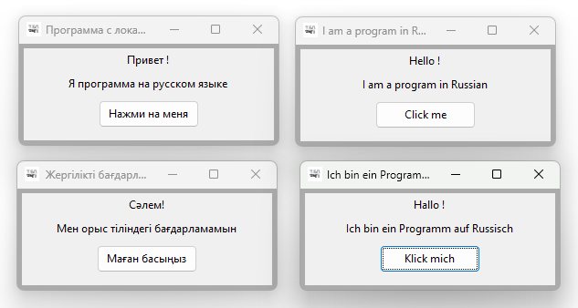

# MySettingLocale
Программа с локализацией на нужный язык для wxWidgets и RedPanda-CPP

## Ссылки:

https://www.wxwidgets.org/

https://poedit.net/

https://github.com/tsnsoft

https://github.com/proffix4?tab=repositories

https://www.youtube.com/@talipovsn
